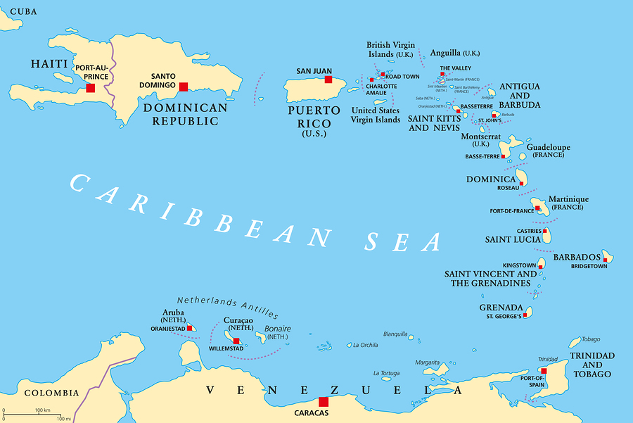

# Data-Analysis-Team-Project

In this assignment, our team was tasked with conducting an analysis utilizing various data on Carribean countries from the World Bank. With our data we were expected to:

* Conduct an exploratory data analysis of our chosen region using Python
* Formulate a strategy for our missing values and identify potential outliers
* Select one country from our region that best represents our region "on average".(Include the rationale for your choice and support it with Python code)
* Identify any obscure findings in our data. In other words "Does our data accurately reflect the region? Can our region's numbers be trusted?"
* Develop a Jupyter Notebook on our process and findings 

